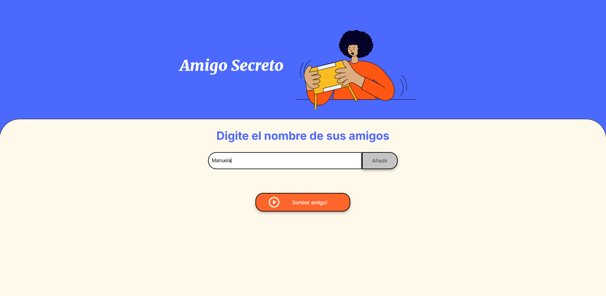
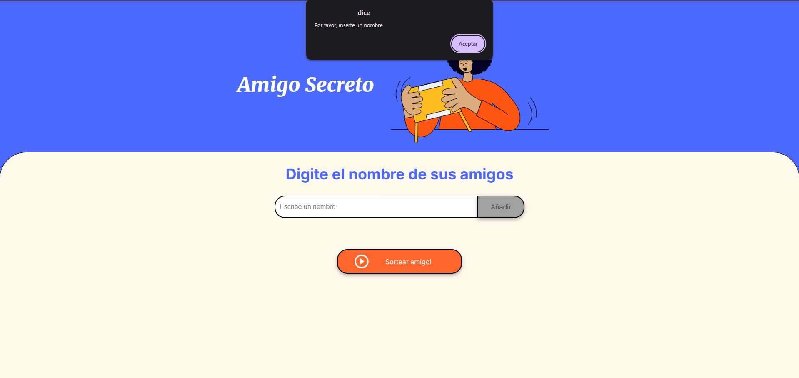
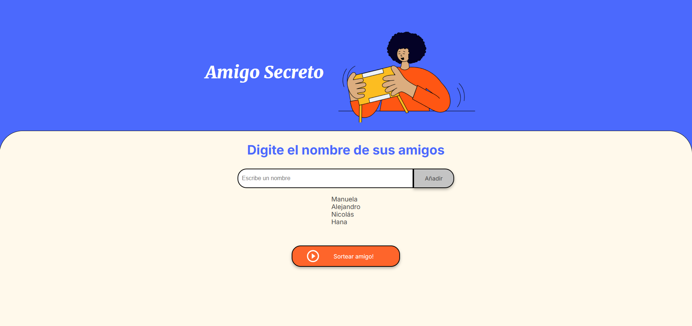
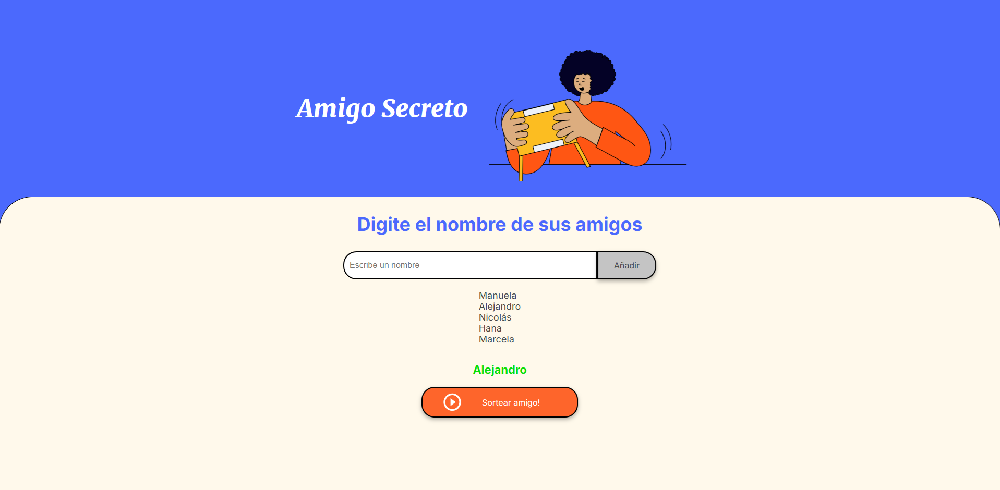

# Challenge Alura - Amigo Secreto

Este proyecto consiste en una aplicación donde los usuarios pueden ingresar nombres en una lista, realizar un sorteo aleatorio y obtener al **Amigo Secreto** asignado. Los nombres se agregan mediante un campo de texto y un botón **Añadir**, permitiendo visualizar la lista completa. Al hacer clic en **Sortear Amigo**, la aplicación selecciona un nombre al azar y muestra el resultado en pantalla.

## Funciones:

- **Agrega nombres:** Los usuarios ingresan nombres en un campo de texto y se agregan al hacer clic en **"Añadir"**.

   

- **Validación de entrada:** Si el campo de texto está vacío o tiene caracteres no válidos, el sistema mostrará una alerta solicitando un nombre válido.

   

- **Visualización dinámica:** Los nombres ingresados aparecerán en una lista actualizada automáticamente debajo.

   

- **Sorteo aleatorio:** Al hacer clic en el botón **"Sortear Amigo"**, el sistema seleccionará aleatoriamente un nombre de la lista y lo mostrará en pantalla.

   